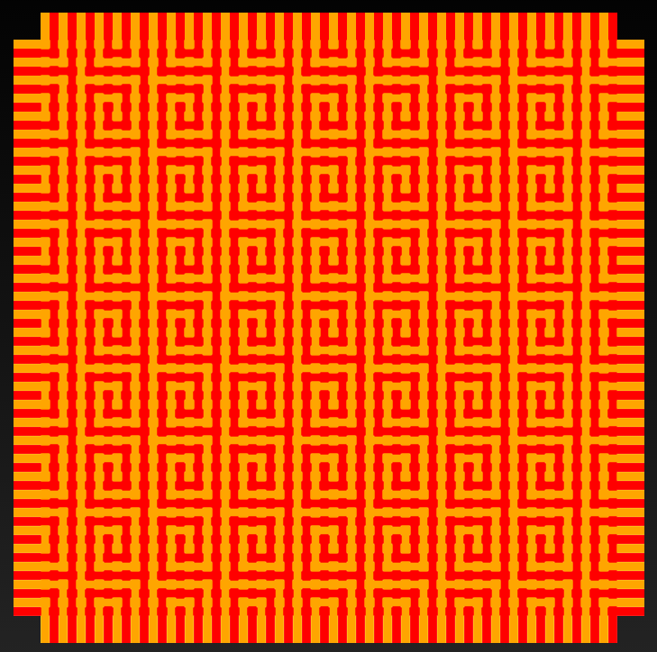

#2D Drawing in Gibber#

At the moment, the way 2D works in Gibber is unfortunately very different from how the rest of Gibber works <sup>1</sup>. For 2D drawing, there is a single object use, `Canvas`. The `Canvas` object allows you to create shapes, fill them, draw lines.. all the normal 2D drawing activities. It is basically a mirror of HTMLs canvas context, but with some sugar added to make programming with it a little more expressive.

One aspect of 2D drawing that is relatively unique to Gibber is that it can be combined with the use of OpenGL shaders. These shaders can quickly add a great deal of visual complexity to simple shapes and patterns, and can be manipulated by audio using [Gibber's mapping abstractions](mappings.html). These shaders can only be used if you are using a WebGL enabled browser on a computer with a graphics card that also supports WebGL. Note that using shaders significantly increases CPU usage, as Gibber will constantly be converting your drawing to a texture that can be transferred to the GPU of your computer.



A weaving in Gibber by yaxu <sup>2</sup>. &#169; Alex McLean (http://yaxu.org/), GPL 3.0

##Getting Started##

Let's get a square drawn on the screen:

```js
canvas = Canvas()
canvas.square( 0,0,400 ) // x, y and size
canvas.fill( 'red' )
```

By default Gibber will create a canvas that fills the entire window and sits in the background of `Column` objects. Our second line of code tells Gibber to create a square path using a provided position and size. This actually doesn't draw the square; to do that we need to use the `stroke` or `fill` method of the canvas object. If we pass a color (this can be any type of CSS color, for example 'red', 'rgb(255,0,0)', or '#ff00000') that color will be used to fill the square; otherwise the last used fill color will be employed.

When working with background canvas objects, it can quickly become difficult to read superimposed code. The keystrokes `Ctrl-Shift-Alt-+` and `Ctrl-Shift-Alt--` allow you to change the background opacity of code to make it more legible.

Alternatively, we can also create a new `Column` object and use this to display our canvas.

```js
column = Column()
canvas = Canvas( column )
canvas.square( 0,0,400 ) // x, y and size
canvas.fill( 'blue' )
canvas.stroke( 'red', 8 ) // color and line width
```

You can clear the canvas at any time with a call to `canvas.clear()`.

##Shapes##

We've already seen that the canvas can easily draw a square. There are three other shapes with built-in convenience methods:

- rectangle( x,y,width,height )
- circle( x,y,radius )
- polygon( x,y,radius,numberOfSides )

Let's draw few of these. Note that we can easily chain method calls:

```js
a = Canvas()
a.rectangle( 0,0,200,400 ).fill('red')
a.circle( a.center.x, a.center.y, 300 ).stroke('green', 4 )
a.polygon( a.center.x, a.center.y, 150, 7).fill( 'blue' )
```

As shown above, the `Canvas` object has a `center` property that we can use for positioning.

##Manipulating the canvas context##

We can rotate the canvas in between drawing operations to create either a series of rotations or an animation of rotation. We can also call the `fade()` method in between drawing operations to fade the canvas out. Using the two of these together can create interesting effects.

```js
a = Canvas()
count = 10

for( var i = 0; i < count; i++ ) {
    a.restore()
    a.fade( .1 )
    a.save()
    a.rotate( .1 * i )
    a.polygon( a.center.x, a.center.y, 250, 5).fill( a.randomColor() )
}
```

There are a couple of points to note. First, we `save` and `restore` the canvas context before rotation. This allows us to easily return the canvas to the state it was at before it was rotated. In this case, we want to apply the fade to the unrotated canvas, so we call `restore` immediately before our call to `fade` (try removing the call to restore and see what happens). Second, we use the `randomColor` method to generate a random color for every polygon we create.


##Animation##

The canvas has a `draw` method that you can override that is called at 30 frames per second. Before calling the `draw` method, the state of the canvas context is saved; after calling `draw` the state is restored. This means you can rotate or translate as you see fit within draw without having to worry about managing state in between frames of animation.

```js
a = Canvas()

var rotation = 0
a.draw = function() {
  a.fade(.1)
  rotation += .05
  a.rotate( rotation )
  a.polygon( a.center.x, a.center.y, 250, 3).stroke( a.randomColor(), 10 )
}
```

The Mouse Trails tutorial <sup>3</sup> is a simple example of using the `draw` method for animation while polling the mouse position.

##Shaders##

Using shaders is discussed more here (not written yet ), but for now I'd point out that it is fun and simple to combine shaders with 2D drawing in Gibber. Here's a simple example using the `Kaleidoscope` and `Dots` shader, that also tracks the `Mouse` position.

```js
Mouse.on() // turn on mouse tracking

a = Canvas()

a.draw = function() {
  a.fade( .05 )
  a.polygon(
    Mouse.x * a.width,
    Mouse.y * a.height,
    300, rndi(5,10)
  )
}

b = Dots()
b.scale = Mouse.X // continuous mapping

c = Kaleidoscope()
c.sides = Mouse.Y // continuous mapping
```

See the [tutorial on mappings in Gibber](./mappings.html) if you're not familiar with the continuous mapping syntax.

###Footnotes###

1. At some point in the future I may change to more of an object-oriented approach for 2D in Gibber... but the ability to draw directly to the canvas will always be available.

2. [http://gibber.mat.ucsb.edu/?p=yaxu/meander](http://gibber.mat.ucsb.edu/?p=yaxu/meander)

3. [http://gibber.mat.ucsb.edu/?p=gibber/Mouse Trails\*2d\*](http://gibber.mat.ucsb.edu/?p=gibber/Mouse Trails*2d*)
