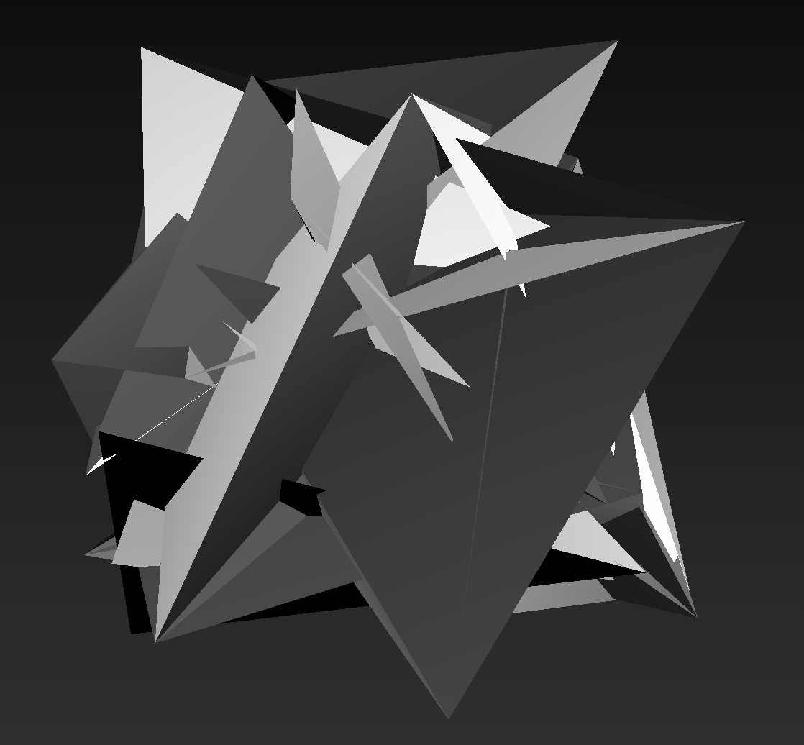

#3D Geometries in Gibber#

The 3D capabilities in Gibber are built around the excellent [Three.js library](http://threejs.org). Gibber provides 3D geometries (with more to come) that take advantage of Gibber's sequencing and mapping abstractions. Below is a list of the current geometries in Gibber and the default values used in their constructors:

```js
Cube:  { width:50, height:50, depth:50 },

Sphere: { radius:50, segments:16, rings: 16 },

Tetrahedron: { radius:50, detail: 0 },

Octahedron: { radius:50, detail: 0 },

Icosahedron: { radius:50, detail: 0 },

Cylinder: { radiusTop:20, radiusBottom:20, height:100, radiusSegments:8, heightSegments:1, openEnded:false},

Torus:  { radius:50, tube:10, radialSegments:8, tubularSegments:8, arc:Math.PI * 2 },

Knot: { radius: 50, tube:5, radialSegments:64, tubularSegments: 8, p:5, q:3, heightScale:1 },

Plane: { width:1, height:1, segmentsWidth:1, segmentsHeight:1 }

Parametric: { func: parametricFunc, slices:8, stacks:8 },
```

The properties outlined above can only be set upon instantiation, as changing them requires an expensive recalculation of the entire underlying mesh. However, all 3D geometries share properties that can be manipulated dynamically, including `scale`, `rotation`, and `position`.

```js
a = Cube({ width:25, height:25, depth:75 })
  .rotation.seq( Rndf(0, Math.PI), ms(250) )
  .scale.seq( Rndf(.5,2), ms(500) )
  .position.x.seq( [-50,0,50], ms(1000) )
```

Note that you can refer to the individual x,y and z components of these properties (as in `.position.x.seq` above) or change the value of all three results simultaneously. For example:

```js
a = Knot({ tube:10 })

// change the scale of all three dimensions
a.scale = .5

// change the scale on the y-axis
a.scale.y = 1.5
```

The ability to selectively target x,y and z components applies to Gibber's sequencing and mapping abstractions as well.

###Color###
Color is not (currently) tied into Gibber's mapping and sequencing abstractions. It is fairly easy to set and manipulate though. The colors consist of three components, `r`,`g`, and `b`. These components all have a value in the range `{0,1}` and can be changed individually.

You can also assign any valid CSS color to a geometry; these values will be converted to the range `{0,1}`.

```js
a = Octahedron() // default color is white, or {r:1, g:1, b:1}
a.color.r = 0    // color is {r:0, g:1, b:1}
a.color.b = 0    // color is {r:0, g:1, b:0}

a.color = '#f00' // color is {r:1, g:0, b:0}
a.color = 'rgb(127,127,0)' // color is {r:.5, g:.5, b:0}
```

##Parametric##


The `Parametric` object in Gibber allows you to define a function that will determine all points in the mesh. By default, Gibber uses a simple noise function:

```js
var parametricFunc = function(u,v) {
  var points = rndf(-50,50,3)

  return Vec3( points[0], points[1], points[2] )
}
```

`Vec3` is a constructor for a three-component vector. This function will be called for every pair `u,v`; `u` is determined by the number of slices in the geometry along the horizontal axis (this can be set upon instantiation) while `v` is set according to the number of stacks along the vertical axis. Below is a function that outputs an approximation of a sphere:

```js
var size = 50
function sphere(u, v) {
  var x,y,z

  u *= Math.PI
  v *= 2 * Math.PI

  x = size * Math.sin( u ) * Math.cos( v )
  y = size * Math.sin( u ) * Math.sin( v )
  z = size * Math.cos( u )

  return Vec3( x,y,z )
}

p = Parametric({ func: sphere }).spin(.0005)
```

##Spinning##
All geometries have a `spin` method that allows them to spin along all three axes. The amount of spin is passed in radians.

```js
// spin .005 radians on each axis per-frame
a = Cube().spin(.005)

// spin only on the y-axis
b = Cube().spin( 0, .005, 0 )

// end spinning
a.spin( 0 ); b.spin( 0 );
```

##Video Textures##
Very simple video texturing can be performed... hassle me if you want more options for this (or if you want options for regular image texturing).

```js
a = Video() // Chrome only

b = Cube({ texture: a }).spin(.005)
```
