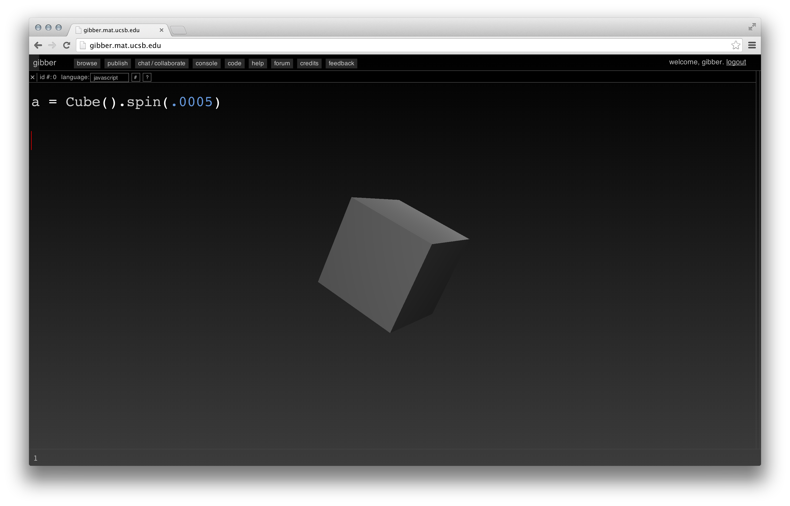

#Getting Started#

##Browser Compatibility##
As of June 2014, Gibber runs best in Chrome, although the new JavaScript engine for Safari is giving Chrome a run for its money. Firefox is also
supported. Internet Explorer isn't supported, but that should change in the near future when the next version of IE (12) gets Web Audio functionality.
Code editing is not supported in mobile browsers, although I hope to change this in the future; it is not an easy task.

Depending on operating system and computer model, WebGL may or may not work on a particular computer. You can still draw in 2D even if WebGL is
disabled. A link is presented in the console to check for WebGL compatibility when Gibber first launches.

##Working in Gibber##
Gibber's environment is fairly simple to use. The primary unit of the environment is the ``Column``; a Gibber column
can consist of a code editor, a graphic user interface (GUI), Gibber's code reference, a chat window, a graphics context, or any number of other
programming tools. These columns can be freely resized by dragging on their borders. Every column is given a unique id # that is present on the left
of the column header. This identifier can be used to identify any column in the global ``Columns`` array for manipulation. As one example:

```
Columns[2].close()
```

... will immediately close a column with an id # of 2. This ability to refer to columns by their id # is used when creating non-fullscreen graphics contexts and when instantiating GLSL shaders in JavaScript using GLSL code found in other columns.

When Gibber is first launched a single code editor and the Console column fill the window. New columns that are created are placed to the right of all existing columns; the window automatically scrolls to new columns to reveal them if they wind up being outside the bounds of the window's viewport.

###Loading and Saving Giblets###

*Giblets* in Gibber are code sketches that can be saved, loaded and shared with other users via a simple hyperlink. In order to save and load giblets, you must first make an account on Gibber's central server. By hitting the publish button in Gibber's main menubar, you can save your giblet to Gibber's database and decide whether or not you want to make it publicly viewable. You can browse all your published sketches by hitting the Browse button in Gibber's main menubar. Once you have published a sketch you can save iterations by simply hitting Ctrl+S.

I will provide more options for local storage in the future; in the meantime, if you don't want to deal with Gibber's central server it is simple to copy and paste to/from a text editor.

##Your First Giblet (aka hello world)##
When learning a programming language, the first task is typically to get the text `Hello, world.' to appear. In Gibber, we can be a little more original and try creating a drum loop (we'll follow that up with a visual example afterwards). Enter the following code into the code editor that appears when you first launch Gibber (the left column width id # 0):

```javascript
a = Drums( 'x*ox*xo-' )
```

To execute the code, highlight it, and then hit Control+Shift+Enter. This will execute the code at the start of the next musical measure, while Control+Enter (no shift) will execute it immediately. In practice it's common to use Control+Shift+Enter when doing audio programming to help ensure that musical sequences are rhythmically aligned.

What happened here? We can roughly break it down into three steps:

- We created a string  ``'x*ox*xo-'`` that is used to define our drum beat. x's represent kick drum hits, o's represent snares, and * / - represent hihats.
- We created a Drums object and passed in sequence we created via our string. When a Drums object is created, you immediately hear it begin to play.
- The Drums object is assigned to the variable `a`. There is special significance to single-letter variable letter names that will be discussed later.


Now try changing the string that makes up the drum beat ``'x*ox*xo-'``). What happens if you change the string to ``'xxxxxxxx'`` and execute the code again? The beat is replaced and now we only hear the kick drum every 1/8th note. It is important to note that the original beat was replaced; this is thanks to using a single-letter variable name, which will be discussed more in the future. For now, notice that if we use a different name, like ``aa``, and repeatedly execute the line of code, multiple drum beats will play simultaneously.

Now that we've created some audio, how about trying our hand at some visuals? The visual equivalent of hello world in Gibber is to place a 3D Geometry on the screen and spin it. Try entering the following line:

```
a = Cube().spin(.001)
```

What happens here?

- We created a Cube object, which is immediately displayed.
- We call the `spin` method of the Cube object, which then spins the cube .001 radians along all axes per frame of video.
- The cube is then stored in the variable `a`.

You'll notice that, similar to the Drums example, if we change the speed for the rotation and re-execute the line of code, we still only have one cube present on the screen. The new cube that we create simply replaces the old one due to the use of a single letter variable name. Also similar to the drums, if we change the name to `aa`, and repeatedly execute the line with different speeds, we'll instead get multiple cubes all spinning at different rates.



###Cleaning Up###
So far we've learned the Control+Enter and Control+Shift+Enter keyboard shortcuts to execute code. Another important shortcut is Control+. (Control plus period). This shortcut executes the following line of code:

```
Gibber.clear()
```

Gibber's ``clear`` removes all elements from the audiovisual graph. It's an especially important one to remember in case you accidentally program something that's really, really loud.

##Summary##

- Highlight code and hit Control+Enter to execute it, or Control+Shift+Enter to execute it at the start of the next musical measure.
- If we store Gibber objects in single letter variables, we can write to that variable over and over again while maintaining a single
  object in the audiovisual graph. The reasons for this remain mysterious, but are promised to be revealed.
- Control+. (Control plus period) clears the Gibber audiovisual graphs of all elements.