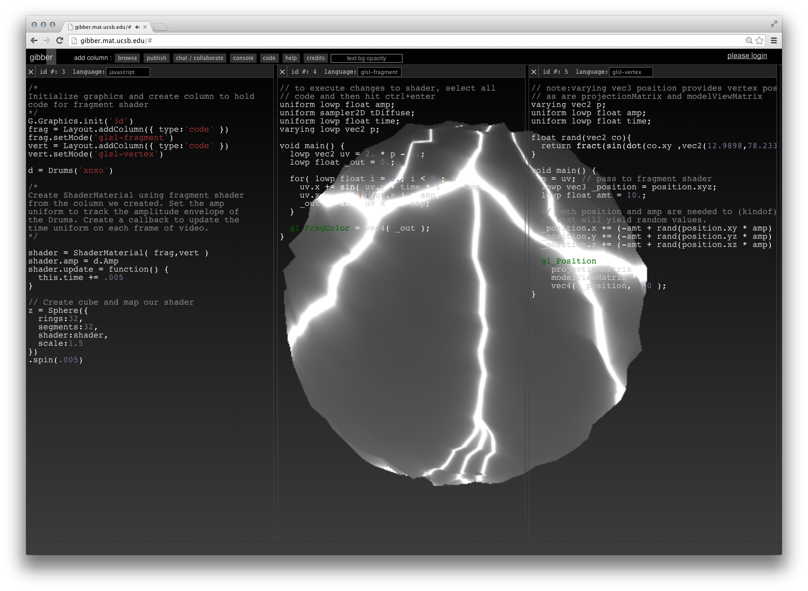

#The Philosophy of Gibber#

Gibber's philosophy is fairly straightforward: enable users to accomplish tasks as quickly as possible, within the constraints of JavaScript.

What tasks can Gibber be used for, then? Mostly experiments and works of audiovisual art, but hopefully there is enough
space in the environment for other ideas and explorations. The objects that come built-in to Gibber are primarily
audio, visual, or interactive. They are created declaratively, and usually only require a single line of code to be instantiated.

*JavaScript*  is the language of choice for a number of reasons1.

- It is the native language of the browser
- It is used in many other multimedia authoring environments, such as Max/MSP, Apple Logic, various Adobe products etc
- It combines object-oriented and functional programming concepts, making it fairly expressive
- Garbage collection and dynamic typing make it easy for budding artist-programmers to begin using it

##Why Immediacy##
It is certainly debatable whether enabling users to accomplish things quickly is a suitable goal in and of itself. By stressing
*immediacy* in all aspects of Gibber, from program notation to collaborative performances, I have tried to make Gibber
easy for beginning programmers to use and also suitable for live coding performances2. I've found that the constraints
of live coding performances align themselves well with programming education; in both cases you want interesting things to happen as quickly
as possible. For live coding performances, this helps ensure the audience doesn't get bored; in teaching programming it helps ensure the same.

The abstractions that make much of Gibber's immediacy possible obscure a great deal of behind-the-scenes activity. Despite hiding this
complexity from end-users, I believe it is possible to scaffold moving from simple, declarative programming strategies to modular, functional approaches. Gibber supports more complicated live coding practices such as temporal recursion3 and also enables end-users to create their own extensions that can be shared
with others using nothing more than a link. In short, there are options available to students who wish to explore advanced concepts in JavaScript programming once they have become familiar with the basics.

##Modalities As Equal & Collaborative Citizens
Another guiding principle is to make audio, visual and interactive programming all equal citizens. In practice individual components of each modality are sparsely implemented. For example, there are only a few varieties 3D geometries available for visual programming; similarly, there is only a single
physical model for audio synthesis. Despite this, in each modality a great deal of complexity is also available. For visual programming, GLSL shaders can be live coded and compiled on-the-fly with extraordinary ease, and audio programming features audio-rate modulation of scheduling and sample accurate timing.

More important than the attempt to bring similar levels of functionality to each modality is the attempt to apply abstractions uniformly across
modalities. As a simple example, accessing the `_` operator of any Gibber object deletes the object and removes it from the audiovisual scene, or interactive GUI. Proxy strategies allow constructors to be repeatedly iterated and executed without changing the state of the audiovisual graphs. All Gibber objects contain similar affordances for multimodal mappings and temporal sequencing. Finally, there is also the tendency to display (either visually or sonically) Gibber objects as soon as they are instantiated, without the need to explicitly add them to audiovisual graphs.

Taken together, Gibber provides a unified approach to managing useful abstractions across modalities while providing an interesting feature set to experiment with. These abstractions enable, for example, the pitch of an oscillator to be tied to the rotation of a 3D geometry with a single line of code. These programming abstractions will be discussed in detail in chapters to come.

####Footnotes####

1: Gibber also supports live coding of graphics shaders using GLSL

2: In a live coding performance a (typically)
audiovisual work is programmed live in front of an audience; see http://toplap.org for more information

3: http://extempore.moso.com.au/temporal_recursion.html
