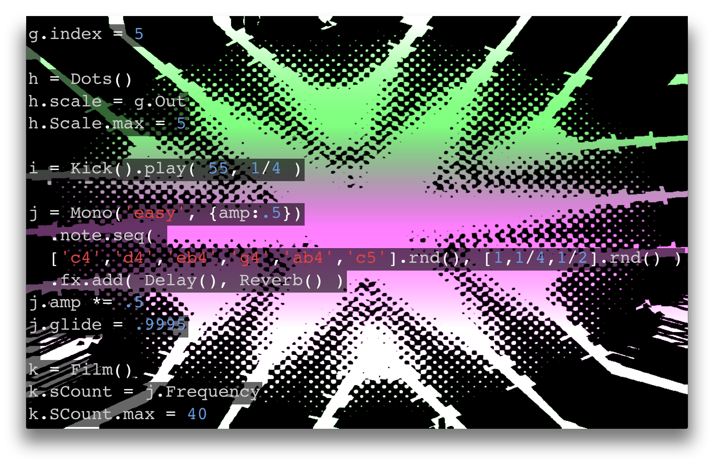

#Using Built-in Shaders#

Gibber comes with a number of included shaders that can easily be layered on top of a rendered scene. You can also create your own shaders from scratch, which will be covered in a later chapter. Most of the pre-built shaders are what is known as *post-processing* shaders. This simply means that each shader processes every pixel in the entire scene, as opposed to a shader attached to a particular geometry. Currently there's only a single *generative* shader that can be used to create content for manipulation<sup>1</sup>, the `Stripes` shader, which creates vertical and horizontal lines. Taken by itself this can be a little boring, but when combined with various post-processing shaders interesting visuals can be obtained using shaders alone.

All of the shaders in Gibber take advantage of the same [mapping](mappings.html) and [sequencing](sequencingPart1.html) abstractions that the synths, audio fx, 2D shapes and 3D geometries use.
The included shaders are:

- Dots: a halftone effect.
- Kaleidoscope: pretty much what you'd expect; a trippy kaleidoscope effect
- Film: a film grain and video scanline simulator.
- Pixellate: a quantization distortion
- Edge: an edge detection algorithm
- Focus: a depth of field effect
- Colorify: posterize the output image with a chosen color
- Bleach: desaturates output colors



##Applying Shaders##

The shaders are basically applied sequentially, stacked on top of one another. In the example below, we start with a `Stripes` shader to generate some content and then stack other shaders on top to create variety.

```js
a = Stripes()
b = Drums('x*xo-*xo')

// map number of lines on x-axis to drums output
a.xCount = b.Out

c = Focus()
c.sampleDistance = Master.Out

d = Kaleidoscope()

// all shaders have update function that is called
// once per frame of video
d.update = function() {
  this.angle += .005 // radians
}

d.sides = 3
```

Like 2D and 3D geometries, shaders have an update function that is called once per frame of video. You can use this to easily add animation to shader uniforms.

Shaders can be removed by calling the `remove` method or by using the `._` property accessor, similar to other objects in Gibber.

###Footnotes###

1. OK, technically there's also a `Circles` shader, but it's pretty darn sad.
