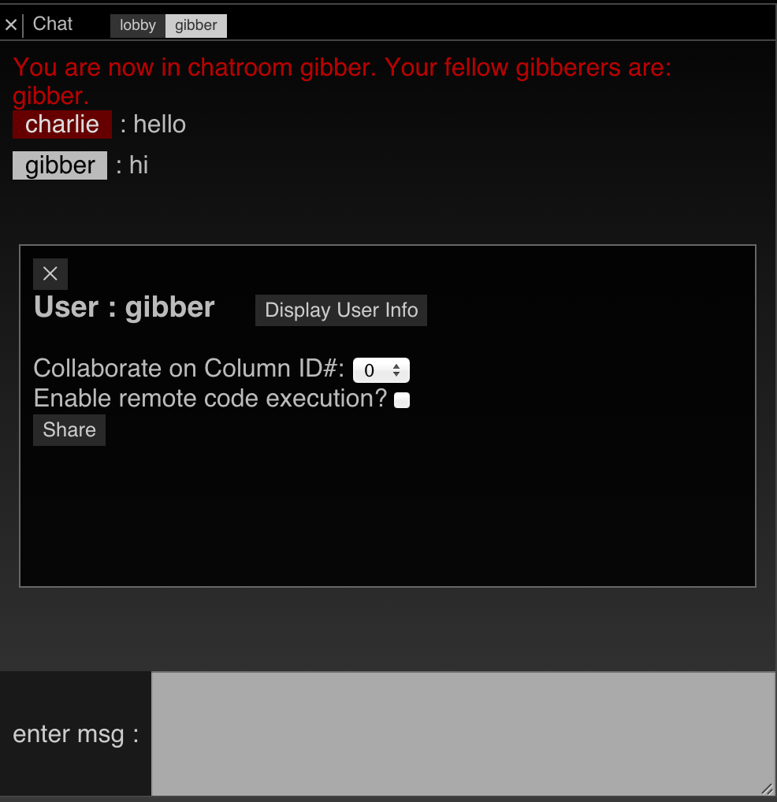
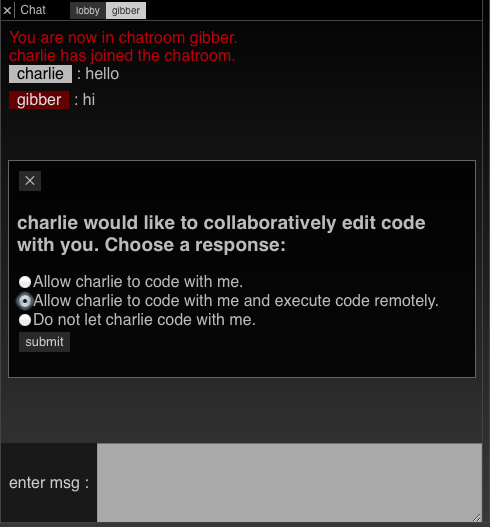
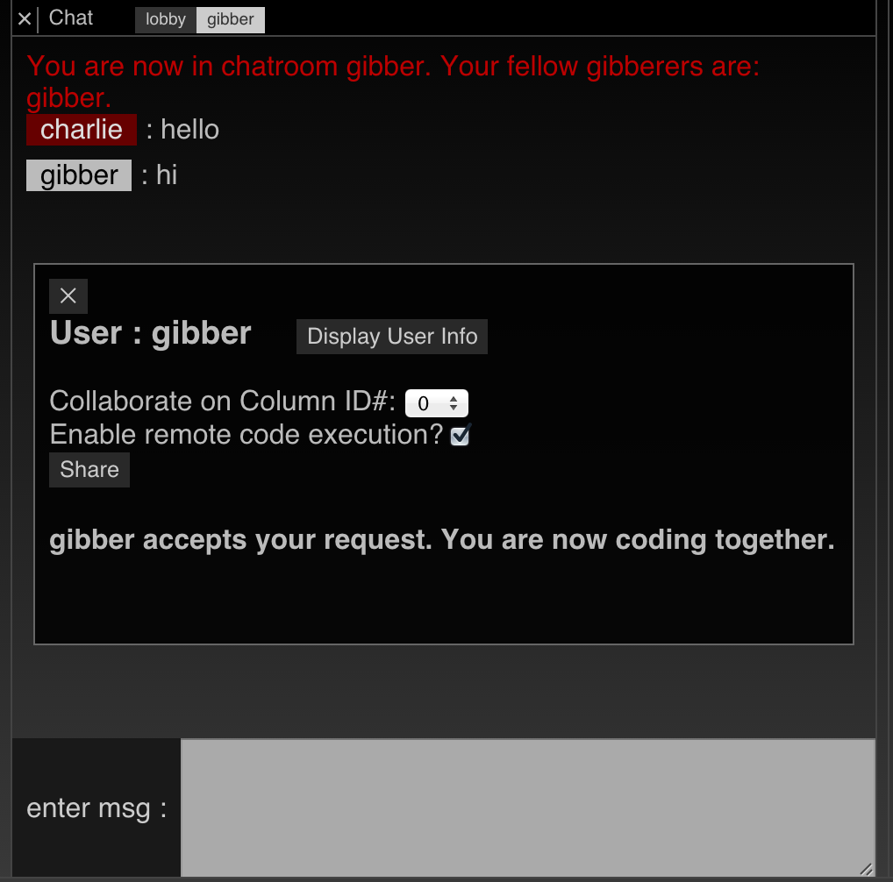

# Collaborative Editing & Networked Performance

Gibber enables users to engage in collaborative editing sessions that can also be used for networked performance. A collaborative editing session can be started between any two users in Gibber's chatrooom. The steps are as follows:

1. If you don't already have a Gibber user account, you can make one by hitting the 'please login' link in the upper lefthand corner of Gibber's interface.
2. Once you are logged in, hit the 'chat / collaborate' button in Gibber's menubar.
3. Click on a chatroom (currently there's only ever one) to enter it in the resulting column.
4. In the chatroom, click on any users name to begin editing with him / her. In the screenshot below, user 'charlie' (let's call him user A) has clicked on the name of user 'gibber' (user B). 
5. The next step is to choose a column you would like to share with the user you have clicked on. Each code column is identified by an id # in the left corner of its column header. This is the number you choose in the 'Collaborate on Column ID#' menu shown in the screenshot above.
6. The next checkbox is 'Enable remote code execution'. If you check this box, Gibber will ask your collaborator to grant you permission to execute code on their computer.
7. After clicking on the 'Share' button, your potential collaborator (user B) will see the following: 
8. Note the three options. If the first option is selected by user B, a collaborative editing session will be started using the code that user A selected. However, neither user will be able to remotely execute code on the other user's computer. This option is enables, for example, teachers to debug code on student computers.
9. The second option starts a collaborative editing session on the column chosen by user A, and also allows both users to execute code both locally and remotely on the other user's computer. Remote code execution is triggered with `Ctrl+Shift+2` (easier to think of as `Ctrl+@`). Upon receiving code to be executed, execution is delayed to the start of the next musical measure.
10. The final option prohibits starting a joint editing session.

If user B accepts the joint editing, user A will see the following message:

User B should now see a new code column displaying the code user A has selected for joint editing.

##Strategies for Networked Performance
In practice, joint editing of a single column seems slightly impractical for performances, although it is possible to do. Problems occur when one user adds text and in doing so, effectively changes the position of text that the other user is editing. This is particuarly problematic when large blocks of text are copied and pasted.

A better method is to share not one, but two columns, and have each performer primarily limit themselves to editing one of them.
Two-column editing with chat seems to be a reasonable configuration for performance.

Gibber has explored other options for networked performance in the past. A number of group performances have been conducted where users type code on their individual laptops and then send it to a central machine for display. This allowed users to audition material on their personal laptops before they send it to the central computer for audiovisual projection. In another performance, users sat in the audience with their laptops (in the style of the group powerbooks unplugged) and passed code fragments around to each other. In the style of the Exquisite Corpse, each fragment was modifed by each user before being sent on to the next and executed. If you are interested in other styles of networked performance using Gibber, please let me know! I would like it to be extensible enough that it can be easily used with a variety of group performance strategies.

